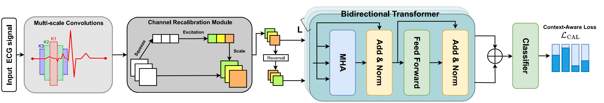
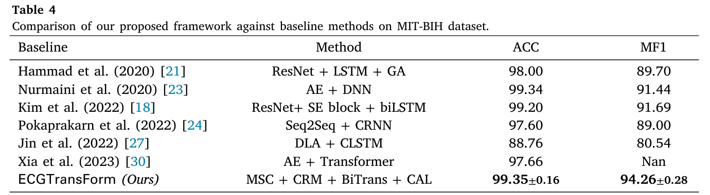

# ECGTransForm: Empowering Adaptive ECG Arrhythmia Classification Framework with Bidirectional Transformer [[Paper](https://www.sciencedirect.com/science/article/pii/S1746809423011473)] [[Cite](#citation)]
#### *by: Hany El-Ghaish, Emadeldeen Eldele*
#### This work is accepted for publication in the Biomedical Signal Processing and Control.

## About

Our proposed model, ECGTransForm, is a deep learning framework for ECG arrhythmia classification, featuring a novel Bidirectional Transformer mechanism and Multi-scale Convolutions for effective spatial and temporal feature extraction. The framework also includes a Context-Aware Loss to handle the class imbalance in ECG data, demonstrating superior performance in arrhythmia diagnosis.


## Datasets
We used two public datasets in this study (Download our preprocessed version of the datasets from [Google Drive](https://drive.google.com/file/d/1eZ7NS7mED2ZCU2YDbeWMmFAc2TsPsX0E/view?usp=sharing)):
- [MIT-BIH](https://www.physionet.org/content/mitdb/1.0.0/)
- [PTB](https://physionet.org/content/ptbdb/1.0.0/)

## Configurations
There are two configuration files: 
- one for dataset configuration `configs/data_configs.py`
- one for training configuration `configs/hparams.py`


## Results
<p align="center">

</p>

## Citation:
If you found this work useful for you, please consider citing it.
```
@ARTICLE{ecgTransForm,
    title = {ECGTransForm: Empowering adaptive ECG arrhythmia classification framework with bidirectional transformer},
    journal = {Biomedical Signal Processing and Control},
    volume = {89},
    pages = {105714},
    year = {2024},
    issn = {1746-8094},
    doi = {https://doi.org/10.1016/j.bspc.2023.105714}, 
    url = {https://www.sciencedirect.com/science/article/pii/S1746809423011473},
    author = {Hany El-Ghaish and Emadeldeen Eldele},
}
```

